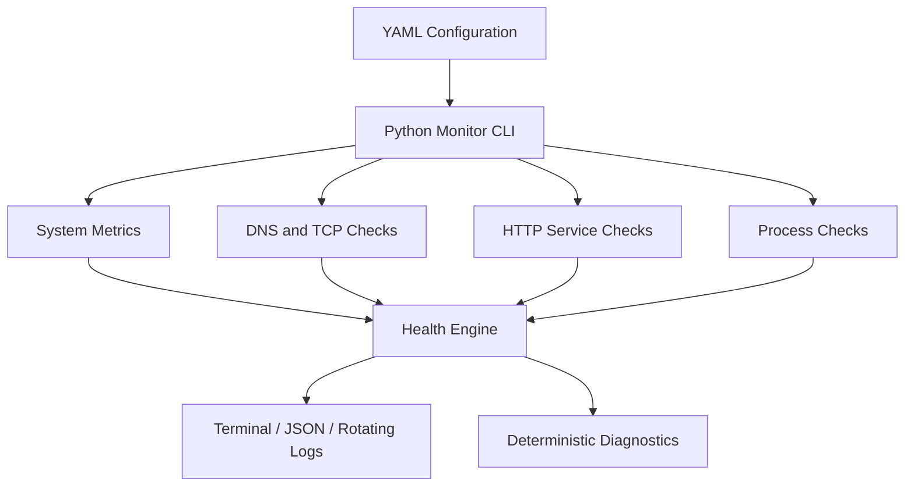

# Cloud Infrastructure Health Monitor

A lightweight Python CLI that provides a quick operational view of host resources, network connectivity, HTTP services, and expected processes. It runs locally on macOS or Linux, requires no paid services, and supports both human-readable and JSON output.

## Why I Built This

Infrastructure teams need fast visibility into server health, network connectivity, and application availability. This project brings common first-response checks into one configurable tool while keeping each component small enough to understand and troubleshoot directly.

## Features

- CPU, memory, disk, uptime, and load-average collection
- DNS resolution and TCP connectivity checks with response timing
- HTTP/HTTPS status and response-time checks
- Exact-name process checks
- Configurable `HEALTHY`, `WARNING`, `CRITICAL`, and `UNKNOWN` states
- YAML configuration with user-friendly validation errors
- Terminal, JSON, one-shot, watch, and section-specific modes
- Rotating operational logs in `logs/monitor.log`
- Evidence-based diagnostics that separate observations from possible causes
- Deterministic incident-context interface for optional future local AI integrations
- Offline unit tests, Docker packaging, and GitHub Actions CI

## Architecture



The CLI loads and validates YAML, invokes independent collectors, normalizes their results through a shared health model, and renders the same data for people, scripts, and logs.

## Quick Start

Requirements: Python 3.10 or newer.

```bash
git clone <repository-url>
cd cloud-infrastructure-health-monitor
python3 -m venv .venv
source .venv/bin/activate
python -m pip install -r requirements.txt
python main.py
```

Common modes:

```bash
python main.py --watch
python main.py --json
python main.py --section system
python main.py --section network
python main.py --section services
python main.py --config path/to/config.yaml
python main.py --help
```

Press `Ctrl+C` to stop watch mode. Run from the repository root unless an explicit configuration path is supplied.

## Example Output

This output was captured from the default Docker image during validation:

```text
============================================================
           CLOUD INFRASTRUCTURE HEALTH MONITOR
============================================================

SYSTEM
CPU Utilization          0.0%                 HEALTHY
Memory Utilization       6.2%                 HEALTHY
Disk Utilization         8.6%                 HEALTHY
System Uptime            3d 01h 55m           HEALTHY
Load Average             3.39 / 4.43 / 2.71   HEALTHY

NETWORK
Cloudflare DNS           73 ms                HEALTHY
Google DNS               46 ms                HEALTHY

SERVICES
Example Service          200 / 1000 ms        HEALTHY

PROCESSES
No checks configured.

------------------------------------------------------------
OVERALL STATUS: HEALTHY
------------------------------------------------------------
Timestamp: 2026-10-07T01:57:22+00:00
```

Values vary by machine and network conditions.

## Real Output 


## Configuration

`config.yaml` is ready to run. `config.example.yaml` shows local-service and process examples. Utilization thresholds are inclusive: a value equal to `warning` is `WARNING`, and one equal to `critical` is `CRITICAL`.

```yaml
monitoring:
  interval_seconds: 30

thresholds:
  cpu: {warning: 75, critical: 90}
  memory: {warning: 80, critical: 95}
  disk: {warning: 80, critical: 90}

network_checks:
  - name: Cloudflare DNS
    host: 1.1.1.1
    port: 53
    timeout_seconds: 2

http_checks:
  - name: Example Service
    url: https://example.com
    expected_status: 200
    timeout_seconds: 5

process_checks:
  - name: SSH daemon
    process_name: sshd
```

The process name must exactly match the executable name reported by the operating system. Invalid YAML, missing fields, invalid ports, unsupported URLs, and inconsistent thresholds return a concise configuration error with exit code `2`.

## Diagnostics and Incident Context

Failures include an observed symptom and clearly labeled investigation ideas. For example, a TCP timeout reports the target and port while listing service availability, firewall rules, and routing as possibilities—not asserted root causes.

`monitor/incident_context.py` converts warning and critical results into a deterministic dictionary with `observed`, `investigation_guidance`, and `advisory` fields. Its small consumer interface could later feed a local Ollama model or another analysis provider. No AI runtime, API, API key, or network service is required; operators must verify any future generated advice against system evidence.

## Docker

```bash
docker build -t cloud-health-monitor .
docker run --rm cloud-health-monitor
docker run --rm cloud-health-monitor python main.py --json
```

To use a custom file, mount it read-only:

```bash
docker run --rm \
  -v "$PWD/config.example.yaml:/app/custom.yaml:ro" \
  cloud-health-monitor python main.py --config /app/custom.yaml
```

Inside Docker, CPU, memory, process, disk, uptime, and load readings reflect the container's namespaces and limits where the platform exposes them. They may not represent the physical host.

## Testing

Tests mock all external TCP and HTTP interactions, so the suite does not require public internet access.

```bash
pytest -q
```

The suite covers threshold and overall-status logic, valid and malformed configuration, CPU/memory/disk classification, and successful and failed TCP/HTTP checks.

## CI

`.github/workflows/test.yml` runs on every push and pull request. It installs the requirements on Python 3.13 and runs `pytest -q`; no repository secrets are required.

## Troubleshooting

- **Configuration error:** read the reported key path, compare with `config.example.yaml`, and validate YAML indentation.
- **DNS resolution failed:** verify the hostname, local resolver configuration, and basic network access.
- **TCP connection failed:** verify the destination and port, then inspect service state, firewall rules, and routing.
- **HTTP status mismatch:** confirm `expected_status`, the route, redirects, and application logs.
- **Process reported missing:** compare `process_name` with the executable name shown by `ps` or Activity Monitor.
- **Uptime is `UNKNOWN`:** the OS or runtime may deny boot-time access. Other checks continue, and the reason is logged.
- **Log file problems:** ensure the current user can create and write the local `logs/` directory.

## Limitations

- This is a lightweight host/infrastructure monitor, not a replacement for an enterprise observability platform.
- It performs checks from one machine and does not store historical metrics.
- TCP success proves connectivity to a port, not application correctness.
- A successful HTTP status does not validate response content or business behavior.
- Process matching uses an exact executable name and does not verify process behavior.
- Load average is reported when supported but has no configurable threshold because interpretation depends on CPU count and workload.
- Container metrics may differ from host metrics.

## Future Improvements

- Prometheus metrics endpoint
- Slack or email notifications
- Multi-host monitoring
- Historical metrics and trend views
- AWS CloudWatch integration
- Remote agent architecture
- Optional local Ollama analysis behind the existing incident-context interface

## License

MIT
